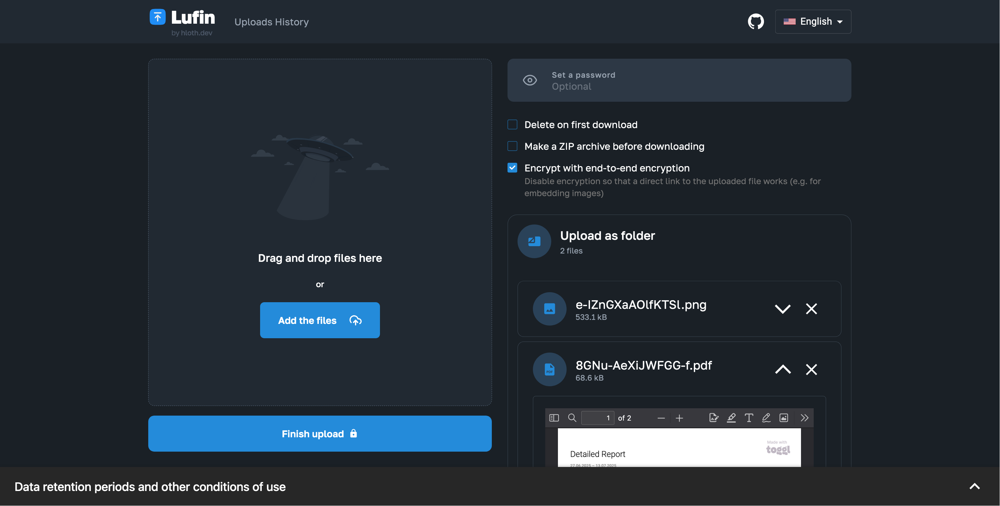
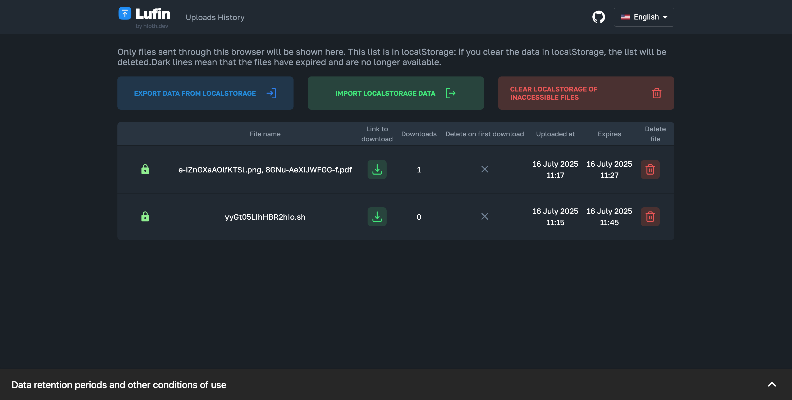
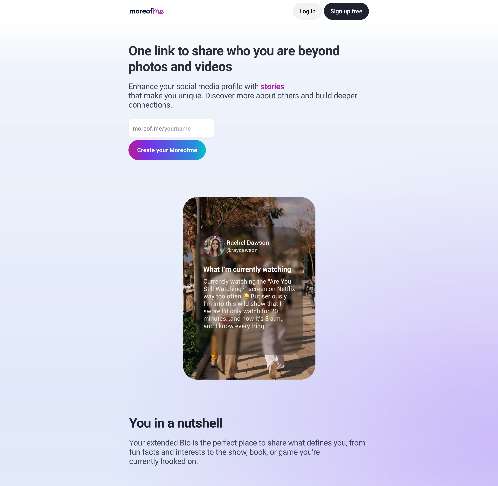
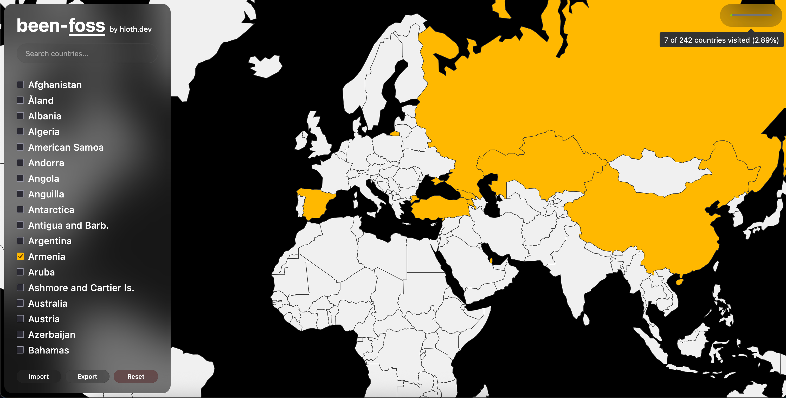

  <samp>
    <a href="https://hloth.dev/me">About me</a> • 
    <a href="https://hloth.dev/donate">Donate</a> • 
    <a href="https://cv.hloth.dev/">Resume / CV</a> • 
    <a href="https://blog.hloth.dev">Blog</a> • 
    <a href="https://www.upwork.com/freelancers/~01a1f59e7a4697be89">Upwork profile</a> • 
    <a href="#reach-me-in-order-of-preference">Contacts</a>
  </samp>

  

### Viktor Shchelochkov (@hloth)

- 🏳️‍🌈	I’m in love with my [boyfriend](https://github.com/devio10)
- 🌱	I’m on Ukrainian side in Russian war against Ukraine. Make love, not war.
- 🤔	I’m looking for a full-time job in Spain, expecting >=100k$/year pre-tax or >=50k$/year **post-tax**, [here is my resume & CV](https://cv.hloth.dev)

✨ **I have over 10 years of development experience, 5 years of freelancing & building commercial projects, can design maintainable, scalable and future-proof systems and always write consistent high quality code — [hire me](mailto:hi@hloth.dev)!** ✨

 I'm in process of migrating to my own self-hosted Git server [git.hloth.dev](https://git.hloth.dev) powered by Forgejo (fork of Gitea).  [Read more](https://github.com/VityaSchel/vityaschel/discussions/4) • [Visit my profile on git.hloth.dev](https://git.hloth.dev/hloth)

  
<b>⚠️ All my commits are signed, reveal to learn how to prove the commit was made by me</b>

   
  
  I'm signing all my commits with [my PGP key](https://hloth.dev/pgp) (you can verify it on Ubuntu and OpenPGP keyservers or using WKD by querying my email address: `hi@hloth.dev`) and have vigilant mode enabled on GitHub. Trust only commits with "Verified" badge from me.

  Below are key IDs you can find by clicking on the "Verified" badge on any individual commit.

  On [hloth git.hloth.dev account](https://git.hloth.dev/hloth) and [VityaSchel GitHub account](https://github.com/VityaSchel):
  - From 17 June 2025, 18:42 UTC: `299E9A450132A28C` (my main EdDSA PGP key)
  - From 2023 to 17 June 2025, 18:42 UTC: `A7EA9B54F67F9685`
  - From 17 July 2022, 13:15 UTC to 2023: `01162BC86DE54C7A`
  - From 2022 to 2024 when I commit from Windows: `62036A0EB54FB7AF`

  On [hloth GitHub account](https://github.com/hloth):
  - From 2023: `04255EC8D29C0AAF`
  - From 2022 to 2023: `DEE0F7C423D3C578`

## Some of my projects

### [Lufin](https://github.com/VityaSchel/lufin)

Lufin (Let’s Upload that File—Next) is a modern alternative to lufi. S3 storage support, rich client-side preview, translated to 26 languages, optional end-to-end encryption, auto metadata stripping, password protection, client-side image compression and more! Written with React and Next.js in 2023.

### [Moreofme — one link to to share what makes you unique](https://blog.hloth.dev/blog/moreofme)

My biggest freelance project recently, built with SvelteKit and Svelte 5. I also learned PostgreSQL in the 4 months that we were building this project and now prefer it over MongoDB.

### [been-foss](https://git.hloth.dev/hloth/been-foss)

Free open source alternative to ad and trackers cluttered "been". It's also much nicer ;) It has no ads, no trackers whatsover and it's static so maybe I'll add offline support someday. Built with Svelte 5.

### Other stuff

<table>
  <thead>
    <tr>
      <th>Featured</th>
      <th>Freelance</th>
      <th>Experimental</th>
    </tr>
  </thead>
  <tbody>
    <tr>
      <td><a href="https://git.hloth.dev/hloth/samsung-pinger">Samsung Pinger widget for macOS</a></td>
      <td><a href="https://github.com/VityaSchel/byom">Build Your Own e2ee post-quantum Messenger developer toolkit</a></td>
      <td><a href="https://git.hloth.dev/hloth/ps4-app-merge-pkgs">PS4 homebrew app to merge .pkgs in C++</a></td>
    </tr>
    <tr>
      <td><a href="https://git.hloth.dev/hloth/mental-health-quiz">Mentral Health Quiz</a></td>
      <td><a href="https://git.hloth.dev/hloth/prankbot">Prankbot website</a></td>
      <td><a href="https://git.hloth.dev/hloth/ketoplan-diet">Keto-plan diet Quiz</a></td>
    </tr>
    <tr>
      <td><a href="https://git.hloth.dev/hloth/meds-reminder">WearOS reminder app for taking meds</td>
      <td><a href="https://git.hloth.dev/hloth/session-id-generator">Vanity Session ID generator (website and CLI)</a></td>
      <td><a href="https://git.hloth.dev/hloth/vfs-status-bot">VFS visa center checking bot</td>
    </tr>
  </tbody>
</table>

<table>
  <thead>
    <tr>
      <th colspan="2">Reverse engineered & HTML scraping</th>
      <th>Other</th>
    </tr>
  </thead>
  <tbody>
    <tr>
      <td><a href="https://git.hloth.dev/hloth/armenia.blsspainglobal.com">BLS Global Visa Center status checker</a></td>
      <td><a href="https://github.com/VityaSchel/q-midpass-ru-autoconfirm">Passport Issuing Gov. status checker</a></td>
      <td><a href="https://git.hloth.dev/hloth/s-otk-js">My local city's transport system API</a></td>
    </tr>
    <tr>
      <td><a href="https://git.hloth.dev/hloth/kspguti-schedule">Parser of my college's website and a better UI for it</a></td>
      <td><a href="https://git.hloth.dev/hloth/my.telegram.org-api-wrapper">Telegram's account settings websites API</a></td>
      <td><a href="https://git.hloth.dev/hloth/asurso">My school's digital assessment diary parser</a></td>
    </tr>
    <tr>
      <td><a href="https://git.hloth.dev/hloth/batumi.bike">batumi.bike — safe bike roads in my city using OSM</td>
      <td><a href="https://git.hloth.dev/hloth/navalnyarrested">Is Alexey Navalny arrested right now?</a></td>
      <td><a href="https://git.hloth.dev/hloth/reddit-request-statistics">Research: Reddit's subreddit adoption statistics</td>
    </tr>
  </tbody>
</table>

### My NPM packages for developers

| Name                                                       | Description                                                                             |
| ---------------------------------------------------------- | --------------------------------------------------------------------------------------- |
| [pow-reaction](https://npmjs.com/package/pow-reaction)     | Proof-of-work reactions for your blogs                                                  |
| [byom](https://npmjs.com/package/byom)                     | Set of pure JavaScript modules to create an end-to-end post-quantum encrypted messenger |
| [@session.js](https://www.npmjs.com/org/session.js)        | JavaScript library for programmatic use of [Session messenger](https://getsession.org)  |
| [lgbt](https://npmjs.com/package/lgbt)                     | Node.js utilities to LGBTize everything                                                 |
| [replica-player](https://npmjs.com/package/replica-player) | Video-player for Svelte that is identical to YouTube's player (WIP)                     |
| [hornet.com](https://npmjs.com/package/hornet.com)         | Browser API wrapper for queer social network hornet.com                                 |
|                                                            |                                                                                         |

  <a href="https://npmjs.com/~vityaschel">Browse all</a>

  

I also commited my work to the Bad Apple community by playing it on lolzteam user's nicknames: [https://git.hloth.dev/hloth/bad-apple](https://git.hloth.dev/hloth/bad-apple)

#### Reach me (in order of preference):
- [@hloth:hloth.dev in Matrix](https://matrix.to/#/@hloth:hloth.dev)
- [hi@hloth.dev via email](mailto:hi@hloth.dev)
- +34 600936082
- [@hlothdev in Telegram](https://t.me/hlothdev) (*slower response time*)

#### My socials:
- [vityaczech in Instagram](https://instagram.com/vityaczech)
- [hloth in Linkedin](https://www.linkedin.com/in/hloth)
- [VityaSchel on Codewars](https://codewars.com/users/VityaSchel)
