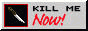
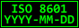

  <samp>
    <a href="https://hloth.dev/me">About me</a> • 
    <a href="https://hloth.dev/donate">Donate</a> • 
    <a href="https://cv.hloth.dev/">Resume / CV</a> • 
    <a href="https://blog.hloth.dev">Blog</a> • 
    <a href="https://www.upwork.com/freelancers/~01a1f59e7a4697be89">Upwork profile</a> • 
    <a href="#reach-out">Contacts</a>
  </samp>

  

### Viktor Shchelochkov (@hloth)

- 🏳️‍🌈	I’m [openly gay](https://instagram.com/hlothdev) and fight for LGBTQIA+ rights and representation
- ☮️	I stand for peace and against violence
- ✨	I’m looking for a full-time remote job in Europe or on-site/hybrid job in Spain — [hire me!](https://cv.hloth.dev)

 I'm now developing my projects on my own self-hosted Git server [git.hloth.dev](https://git.hloth.dev) powered by Forgejo (fork of Gitea).  [Read more](https://github.com/VityaSchel/vityaschel/discussions/4) • [Visit my profile on git.hloth.dev](https://git.hloth.dev/hloth)

  
<b>⚠️ All my commits are signed, reveal to learn how to check if the commit was signed by me</b>

   
  
  I'm signing all my commits with [my PGP key](https://hloth.dev/pgp) (you can verify it on Ubuntu and OpenPGP keyservers or using WKD by querying my email address: `hi@hloth.dev`) and have vigilant mode enabled on GitHub. Trust only commits with "Verified" badge from me.

  Below are key IDs you can find by clicking on the "Verified" badge on any individual commit.

  On [hloth git.hloth.dev account](https://git.hloth.dev/hloth) and [VityaSchel GitHub account](https://github.com/VityaSchel):
  - From 17 June 2025, 18:42 UTC: `299E9A450132A28C` (my main EdDSA PGP key)
  - From 2023 to 17 June 2025, 18:42 UTC: `A7EA9B54F67F9685`
  - From 17 July 2022, 13:15 UTC to 2023: `01162BC86DE54C7A`
  - From 2022 to 2024 when I commit from Windows: `62036A0EB54FB7AF`

  On [hloth GitHub account](https://github.com/hloth):
  - From 2023: `04255EC8D29C0AAF`
  - From 2022 to 2023: `DEE0F7C423D3C578`

 ⚖ All my projects are licensed under MIT (except forks and derivative works based on GPL-licensed projects). Learn more: <a href="https://mit.hloth.dev/" target="_blank" rel="noopener noreferrer">mit.hloth.dev</a>. Submit a complaint : <a href="https://change.mit.hloth.dev/" target="_blank" rel="noopener noreferrer">change.mit.hloth.dev</a>.

## Open source projects

- [Lufin](https://git.hloth.dev/hloth/lufin) — a modern alternative to lufi, an end-to-end-encrypted file sharing platform 
- [been-foss](https://git.hloth.dev/hloth/been-foss) — Free open source alternative to ad and trackers cluttered "been" 
- [Samsung Pinger](https://git.hloth.dev/hloth/samsung-pinger) — macOS widget to ping Samsung phones via reverse engineered API 
- [ps4-app-merge-pkgs](https://git.hloth.dev/hloth/ps4-app-merge-pkgs) — PlayStation 4 homebrew app to merge .pkgs written fully in C++ 
- [SIPacker](https://git.hloth.dev/hloth/sipacker) — SiGame packs web editor built with React and Material UI 
- [Session.js](https://git.hloth.dev/session.js) — JavaScript library for programmatic use of Session messenger 
- [session-id-generator](https://git.hloth.dev/hloth/session-id-generator) — generate Session messenger vanity IDs (website and CLI) 
- [byom](https://git.hloth.dev/VityaSchel/byom) — Build Your Own e2ee post-quantum Messenger developer toolkit 
- [pow-reaction](https://git.hloth.dev/hloth/pow-reaction) — proof-of-work reactions for blogs and websites 
- [hornet.com](https://git.hloth.dev/hloth/hornet.com) — browser API wrapper for queer social network hornet.com 
- [batumi.bike](https://git.hloth.dev/hloth/batumi.bike) — safe bike roads in my city using OSM 

### Freelance projects

- [Mentral Health Quiz](https://git.hloth.dev/hloth/mental-health-quiz)
- [Prankbot website](https://git.hloth.dev/hloth/prankbot)
- [Keto-plan diet Quiz](https://git.hloth.dev/hloth/ketoplan-diet)

More freelance projects without public repos: [Websites & projects at hloth.dev](https://hloth.dev)

### Personal projects

- [Parser of my college's website and a better UI for it](https://git.hloth.dev/hloth/kspguti-schedule)
- [VFS visa center checking bot](https://git.hloth.dev/hloth/vfs-status-bot)
- [BLS Global Visa Center status checker](https://git.hloth.dev/hloth/armenia.blsspainglobal.com)
- [Passport Issuing Gov. status checker](https://github.com/VityaSchel/q-midpass-ru-autoconfirm)
- [My local city's transport system reverse engineered API](https://git.hloth.dev/hloth/s-otk-js)
- [My school's digital assessment diary parser](https://git.hloth.dev/hloth/asurso)
- [WearOS reminder app for taking meds](https://git.hloth.dev/hloth/meds-reminder)

### Other notable projects

- [Telegram.org account settings websites API](https://git.hloth.dev/hloth/my.telegram.org-api-wrapper)
- [Research: Reddit's subreddit adoption statistics](https://git.hloth.dev/hloth/reddit-request-statistics)
- [Is Alexey Navalny arrested right now?](https://git.hloth.dev/hloth/navalnyarrested)
- [My Bad Apple collection contribution](https://git.hloth.dev/hloth/bad-apple)

[NPM packages](https://npmjs.com/~vityaschel) · [JSR packages](https://jsr.io/@hloth) · [GitHub gists](https://gist.github.com/VityaSchel/) · [More open source projects](https://git.hloth.dev/hloth?tab=repositories)

## Reach out

💬 [@hloth:hloth.dev in Matrix](https://matrix.to/#/@hloth:hloth.dev) \
📧 [hi@hloth.dev via email](mailto:hi@hloth.dev) \
✉️ [@hlothdev in Telegram](https://t.me/hlothdev) \
📞 [+34 600936082](tel:+34600936082) \
📷 [@hlothdev in Instagram](https://instagram.com/hlothdev) \
📄 [in/hloth in Linkedin](https://www.linkedin.com/in/hloth)

